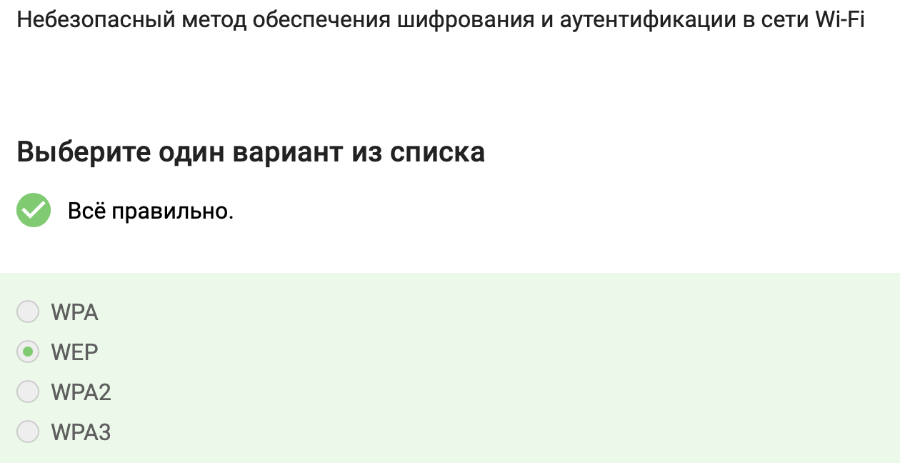

---
## Front matter
title: "Отчет по внешнему курсу"
subtitle: "Тема: Безопасность в сети"
author: "Шубнякова Дарья НКАбд-03-22"

## Generic otions
lang: ru-RU
toc-title: "Содержание"

## Bibliography
bibliography: bib/cite.bib
csl: pandoc/csl/gost-r-7-0-5-2008-numeric.csl

## Pdf output format
toc: true # Table of contents
toc-depth: 2
lof: true # List of figures
lot: true # List of tables
fontsize: 12pt
linestretch: 1.5
papersize: a4
documentclass: scrreprt
## I18n polyglossia
polyglossia-lang:
  name: russian
  options:
    - spelling=modern
    - babelshorthands=true
polyglossia-otherlangs:
  name: english
## I18n babel
babel-lang: russian
babel-otherlangs: english
## Fonts
mainfont: PT Serif
romanfont: PT Serif
sansfont: PT Sans
monofont: PT Mono
mainfontoptions: Ligatures=TeX
romanfontoptions: Ligatures=TeX
sansfontoptions: Ligatures=TeX,Scale=MatchLowercase
monofontoptions: Scale=MatchLowercase,Scale=0.9
## Biblatex
biblatex: true
biblio-style: "gost-numeric"
biblatexoptions:
  - parentracker=true
  - backend=biber
  - hyperref=auto
  - language=auto
  - autolang=other*
  - citestyle=gost-numeric
## Pandoc-crossref LaTeX customization
figureTitle: "Рис."
tableTitle: "Таблица"
listingTitle: "Листинг"
lofTitle: "Список иллюстраций"
lotTitle: "Список таблиц"
lolTitle: "Листинги"
## Misc options
indent: true
header-includes:
  - \usepackage{indentfirst}
  - \usepackage{float} # keep figures where there are in the text
  - \floatplacement{figure}{H} # keep figures where there are in the text
---

# Задания

№1) HTTPS (Hypertext Transfer Protocol Secure) является протоколом прикладного уровня по следующим причинам:
- HTTPS основан на протоколе HTTP, который определяет несколько типов запросов и ответов для передачи данных между клиентом и сервером на прикладном уровне модели OSI.
- HTTPS расширяет протокол HTTP для поддержки шифрования данных в целях повышения безопасности передачи информации. Он использует криптографические протоколы SSL/TLS для "упаковки" данных в зашифрованный вид.
- HTTPS работает поверх протоколов транспортного уровня, таких как TCP, обеспечивая надежную передачу данных без потерь. Однако сам HTTP не требует использования соединений, полагаясь на надежность транспортного протокола.
- Применение HTTPS на прикладном уровне позволяет обеспечить безопасность передачи конфиденциальных данных, таких как данные кредитных карт или личная информация пользователей, защищая их от перехвата злоумышленниками в сети.

{width=80%}

№2) Протокол TCP - это самый популярный протокол транспортного уровня, и основная его задача - обеспечить надежную передачу данных между процессами на разных машинах, то есть между моим запросом, набранным в браузере, веб-серверу, где этот веб-сайт лежит. 

{width=80%}

№3) В соответствии со стандартом IPv4, IP-адрес состоит из четырех числовых блоков, записанных в десятичной системе счисления, и может принимать значения от 0 до 255 в каждом блоке. 421.0.15.19 - первый блок превышает максимальное значение 255
    43.12.256.7 - третий блок превышает максимальное значение 255

{width=80%}

№4) DNS-сервер сопоставляет IP-адреса доменным именам.
Основная функция DNS-сервера - это перевод доменных имен веб-ресурсов в IP-адреса, по которым осуществляется маршрутизация пакетов в сети. Каждый провайдер использует свои DNS-адреса при подключении пользователей.

{width=80%}

№5) Эта последовательность соответствует структуре модели TCP/IP, где протоколы прикладного уровня (например, HTTP, FTP) находятся выше протоколов транспортного уровня (TCP, UDP), затем следуют протоколы сетевого уровня (IP), и, наконец, протоколы канального уровня (Ethernet, Wi-Fi)

{width=80%}

№6) Протокол HTTP предполагает передачу данных между клиентом и сервером в открытом виде.
HTTP сам по себе не предусматривает шифрование передаваемой информации. Данные передаются в текстовом виде, что делает возможным их перехват злоумышленниками.
Для обеспечения безопасности передачи конфиденциальных данных используется расширение HTTP, называемое HTTPS (HTTP Secure). HTTPS реализует упаковку данных в криптографический протокол SSL/TLS, обеспечивая их шифрование.

{width=80%}

№7) Протокол HTTPS состоит из двух фаз: рукопожатия и передачи данных.
Фаза рукопожатия (handshake):
- Браузер запрашивает SSL-сертификат сервера
- Сервер отправляет SSL-сертификат
- Браузер проверяет подлинность сертификата
- Генерируется общий секретный ключ для шифрования
Фаза передачи данных:
- Данные шифруются с помощью общего ключа
- Зашифрованные данные передаются между клиентом и сервером
- На стороне получателя данные расшифровываются с помощью общего ключа

{width=80%}

№8) Версия протокола TLS определяется клиентом и сервером в процессе "переговоров" (TLS-рукопожатия).
В ходе TLS-рукопожатия клиент и сервер обмениваются сообщениями, в которых указывают, какую версию TLS (1.0, 1.1, 1.2, 1.3 и т.д.) они будут использовать для установления защищенного соединения.
Клиент предлагает список поддерживаемых им версий TLS, а сервер выбирает наиболее подходящую версию из предложенных клиентом. Таким образом, окончательная версия TLS определяется в результате согласования между клиентом и сервером.

{width=80%}

№9) В фазе "рукопожатия" протокола TLS не предусмотрено шифрование данных.
Основные шаги TLS-рукопожатия включают:
- Обмен сообщениями "hello" между клиентом и сервером
- Обмен SSL-сертификатами
- Согласование набора шифров
- Генерация случайных данных для создания сеансовых ключей
Однако сами данные на этом этапе не шифруются. Шифрование происходит только после завершения рукопожатия, когда устанавливается защищенное соединение.

{width=80%}

№10) Что хранят в себе куки? Куки, как правило, хранят в себе список параметров и их значений. Этими параметрами могут быть id пользователя, id сессии, иногда описан тип браузера и время запросов и некоторые действия пользователей. Опять же, если это интернет-магазин, то в куки может храниться то, что мы просматривали, какие страницы мы посещали. В куки никогда не хранятся пароли или хэш от паролей пользователя, куки для этого не предназначены и не должны хранить наши пароли. 

{width=80%}

№11) Куки не влияют на надежность соединения между клиентом и сервером. Их основная функция - хранение данных на стороне клиента для улучшения пользовательского опыта и сбора аналитики.

{width=80%}

№12) Когда пользователь посещает веб-сайт, сервер отправляет куки на устройство пользователя, где они сохраняются и используются для хранения информации о взаимодействии пользователя с сайтом. 

{width=80%}

№13) Сессионные куки - это тип куков, которые сохраняются лишь в течение одной сессии и стираются сразу после закрытия браузера. Они не сохраняются на устройстве пользователя после закрытия браузера и не имеют срока годности. Их основное назначение - хранить информацию о состоянии сеанса доступа, чтобы обеспечить удобство пользователя при работе с веб-сайтом.

{width=80%}

№14) Узлы разделяются на охранный узел, промежуточный и выходной. Соответственно выходной узел, поскольку он является узлом перед получателем, знает, кому направлен пакет. Охранный узел знает, от кого пришёл пакет, поскольку он непосредственно является следующим узлом после отправителя, в то время как промежуточный узел не знает ни от кого этот пакет, ни кому он предназначен. В браузере Tor всегда есть три роутера, их не больше и не меньше. Их не меньше потому, что меньшего числа узлов не хватает для анонимизации, а большее число узлов не дает большую анонимизацию, поэтому выбирается всегда 3 луковых роутера. 

{width=80%}

№15) Первым делом встроенный алгоритм в вашем браузере, который знает, кому в итоге пакет должен прийти и какие узлы могут доставить ваш пакет тому, куда он должен прийти.
Соответственно выходной узел, поскольку он является узлом перед получателем, знает, кому направлен пакет. В итоге последний выходной узел может с помощью своего ключа дешифровать эти данные и увидеть в нем, кому в итоге этот пакет принадлежит. Заметьте, все предыдущие узлы не знали ни в каком виде, кому этот пакет принадлежит, они просто, имея какие-то ключевые значения, передавали пакет от одного узла к следующему. После дешифровки этот пакет перенаправляется его получателю, получатель видит данные, и дальше происходит обычное интернет-общение между отправителем и получателем. Вот так работает луковая маршрутизация. 

{width=80%}

№16) Он генерирует общие ключи последовательно с охранным узлом A, далее с промежуточным узлом B, а потом и с выходным узлом C. Вначале он непосредственно генерирует общий ключ KSA, то есть между отправителем S и охранным узлом A, потом охранный узел помогает сгенерировать общий ключ между S и между B, промежуточным узлом. Он перенаправляет данные, которые идут от отправителя к промежуточному узлу. Таким образом, охранный узел не знает, какой ключ между ними сгенерировался, то есть он не знает KSB. Однако он помогает при передаче публичной информации, с помощью которой два узла могут сгенерировать общий ключ. И то же самое с последним выходным узлом, тут уже и A, и B помогают перенаправлять данные в процессе генерации этого ключа. 

{width=80%}

№17) Нет, получателю не обязательно использовать браузер Tor или другой браузер, основанный на луковой маршрутизации, для успешного получения пакетов.
Tor обеспечивает анонимность и шифрование трафика на пути от отправителя к получателю, но не требует от получателя использования Tor. Пакеты, отправленные через Tor, будут доставлены получателю обычным способом, без необходимости применения Tor на стороне получателя.

{width=80%}

№18) Вообще, WiFi - это технология беспроводной локальной сети, она основана на стандарте IEEE 802.11. IEEE – это организация, которая описывает вообще любые стандарты того, как работает интернет. В частности, она описывает, как должен работать беспроводной интернет, и номер этого стандарта 802.11, и все последующие модификации (этот стандарт модифицируется с течением времени) носят название 802.11 и далее какие-то буквы. 

{width=80%}

№19) Вспомним модель TCP/IP с первой лекции и зададимся вопросом, на каком уровне работает WiFi, WiFi работает на самом нижнем канальном уровне, на том же уровне, где работает протокол Ethernet (это протокол, обеспечивающий продвижение данных по проводу). И в этом нет ничего удивительного, поскольку по своей сути технология WiFi очень похожа на технологию Ethernet, только передает данные не по кабелю, а по радиосигналу.

{width=80%}

№20) WEP (Wired Equivalent Privacy) - это небезопасный метод обеспечения шифрования и аутентификации в сети Wi-Fi.
Самый ранний и на сегодняшний день небезопасный метод шифрования данных WiFi. Он устарел и уже категорически не рекомендуется к использованию. Он устарел, в частности, потому, что использовал малую длину ключа: так, например, он использовал длину ключа в 40 бит, это довольно мало на сегодняшний день, он может быть легко взломан. 

{width=80%}

№21) Когда мы с вами соединяемся к роутеру, мы шифруем наши данные, и до того, как начать шифрование, мы аутентифицируем себя, свое устройство этому самому роутеру.

{width=80%}

№22) WPA Personal - это классическая аутентификация по паролю, как правило, такой алгоритм используется в домашних сетях или в небольших корпоративных сетях; более сложный метод аутентификации называется WPA Enterprise - это когда у нас существует база данных всех зарегистрированных пользователей, и когда человек подключается к сети WiFi, по этой базе данных проверяется, есть ли он в базе или нет, и как правило, сама эта база данных со списком разрешенных пользователей находится на специальных серверах. Это довольно сложное устройство аутентификации, которое, скорее всего, не нужно для маленьких домашних сетей.

{width=80%}
