---
## Front matter
title: "Отчет по внешнему курсу"
subtitle: "Тема: Защита ПК/Телефона"
author: "Шубнякова Дарья НКАбд-03-22"

## Generic otions
lang: ru-RU
toc-title: "Содержание"

## Bibliography
bibliography: bib/cite.bib
csl: pandoc/csl/gost-r-7-0-5-2008-numeric.csl

## Pdf output format
toc: true # Table of contents
toc-depth: 2
lof: true # List of figures
lot: true # List of tables
fontsize: 12pt
linestretch: 1.5
papersize: a4
documentclass: scrreprt
## I18n polyglossia
polyglossia-lang:
  name: russian
  options:
    - spelling=modern
    - babelshorthands=true
polyglossia-otherlangs:
  name: english
## I18n babel
babel-lang: russian
babel-otherlangs: english
## Fonts
mainfont: PT Serif
romanfont: PT Serif
sansfont: PT Sans
monofont: PT Mono
mainfontoptions: Ligatures=TeX
romanfontoptions: Ligatures=TeX
sansfontoptions: Ligatures=TeX,Scale=MatchLowercase
monofontoptions: Scale=MatchLowercase,Scale=0.9
## Biblatex
biblatex: true
biblio-style: "gost-numeric"
biblatexoptions:
  - parentracker=true
  - backend=biber
  - hyperref=auto
  - language=auto
  - autolang=other*
  - citestyle=gost-numeric
## Pandoc-crossref LaTeX customization
figureTitle: "Рис."
tableTitle: "Таблица"
listingTitle: "Листинг"
lofTitle: "Список иллюстраций"
lotTitle: "Список таблиц"
lolTitle: "Листинги"
## Misc options
indent: true
header-includes:
  - \usepackage{indentfirst}
  - \usepackage{float} # keep figures where there are in the text
  - \floatplacement{figure}{H} # keep figures where there are in the text
---

# Задания

№1) Программа берет этот ключ, берет наши данные, будь то весь жесткий диск или какой-то его сегмент или может быть даже загрузочный сегмент, и шифрует данные с помощью ключа.

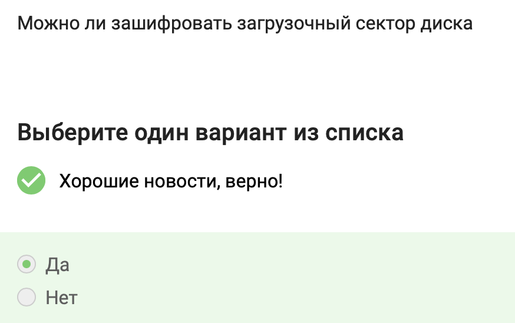{width=80%}

№2) Шифрование больших объемов данных, например, жесткого диска или сегмента жесткого диска или какой-то большой флешки, осуществляется с помощью симметричного шифрования, как правило, алгоритма AES. Это американский стандарт симметричного шифрования, он также используется для конфиденциальной передачи данных по сети. Это эффективный алгоритм, который реализован в процессорах быстро, то есть на аппаратном уровне.

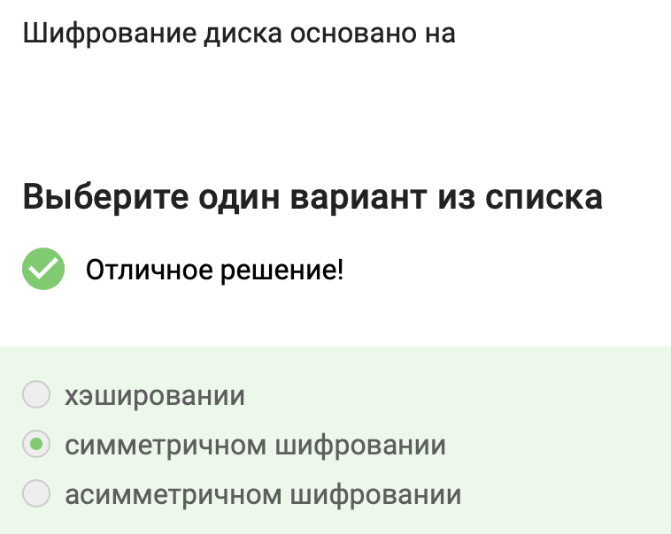{width=80%}

№3) Во всех популярных операционных системах есть встроенные утилиты, которые позволяют шифровать жесткий диск: для Windows этo Bitlocker, в Linux – LUKS, в MacOS – это FileVault. Кроме того, есть и сторонние опенсорсные (open source) программы, то есть бесплатные: это Veracrypt, PGPDisk, которые вы можете установить себе и использовать их для шифрования ваших жестких дисков, загрузочных секторов или флешек. 

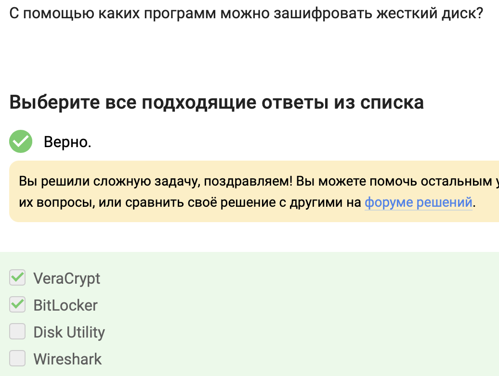{width=80%}

№4) Основной критерий стойкости пароля - это сложность его перебора. Самая основная атака на наши пароли - это банальный перебор всевозможных паролей, если мы знаем, что, например, пароль состоит из цифр и букв алфавита и каких-то еще символов, мы знаем в принципе весь алфавит, мощность этого алфавита, если мы еще, допустим, знаем длину пароля, то мы можем точно посчитать, каков размер множества всех паролей.

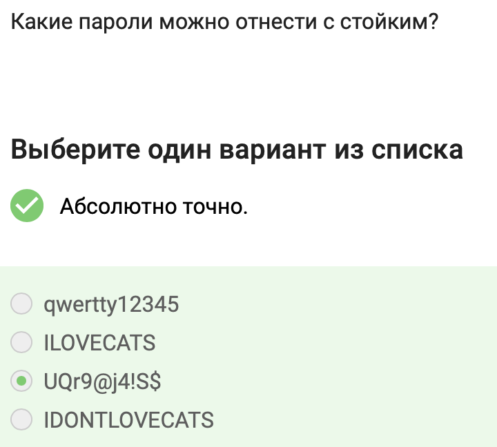{width=80%}

№5) Понятно, что нужно использовать длинные пароли с максимально большим алфавитом, хранить их стоит в менеджерах паролей, пароли нужно менять достаточно регулярно, особенно к таким критическим сервисам, как почта.

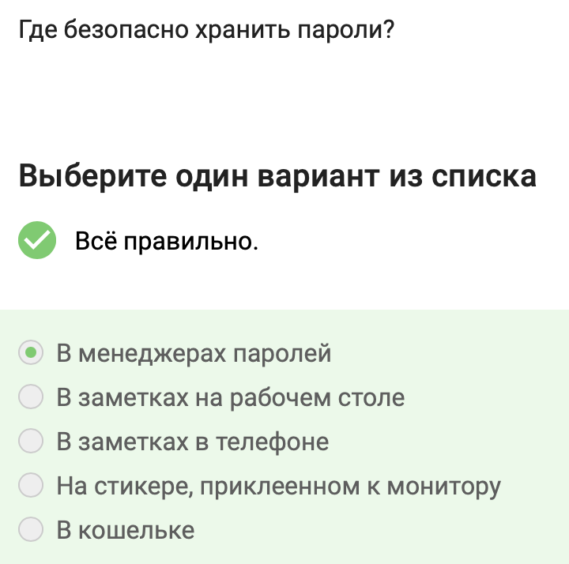{width=80%}

№6) Капча - это аббревиатура с английского; это тест для определения, является ли пользователь, который общается с веб-сервисом, человеком или компьютером, ботом, которой пытается просто-напросто перебрать все пароли.

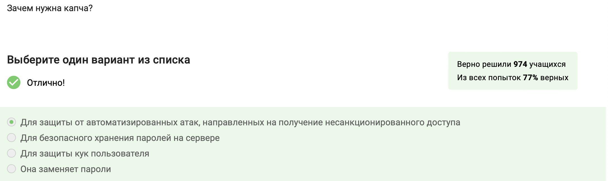{width=80%}

№7) Хэширование паролей используется для обеспечения безопасности, позволяя хранить пароли в зашифрованной форме, что минимизирует риски их утечки и неправомерного использования. Основная цель хэширования паролей - не хранить пароли в открытом виде на сервере, что делает их надежными и сложно восстанавливаемыми.

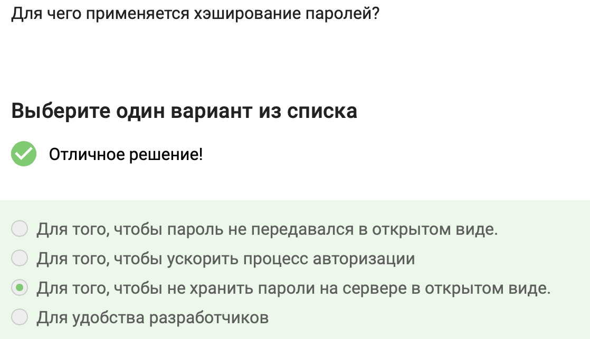{width=80%}

№8) Соль не поможет улучшить стойкость паролей к атаке перебором, если злоумышленник получил доступ к серверу. Для защиты паролей от взлома в этом случае необходимо использовать хэширование с солью.
Хэширование с солью - это процесс добавления случайной строки (соли) к паролю перед хэшированием. Это позволяет избежать ситуации, когда одинаковые пароли разных пользователей имеют одинаковые хэши, что повышает стойкость к атакам перебора.
Однако, если злоумышленник получил доступ к серверу, он может получить и соль, и хэши паролей. В этом случае соль не защитит от атаки перебора, так как злоумышленник может применить ее к словарю паролей и сравнить с украденными хэшами.
Таким образом, для защиты паролей от взлома при компрометации сервера необходимо использовать стойкие хеш-функции, соль, а также другие меры безопасности, такие как двухфакторная аутентификация.

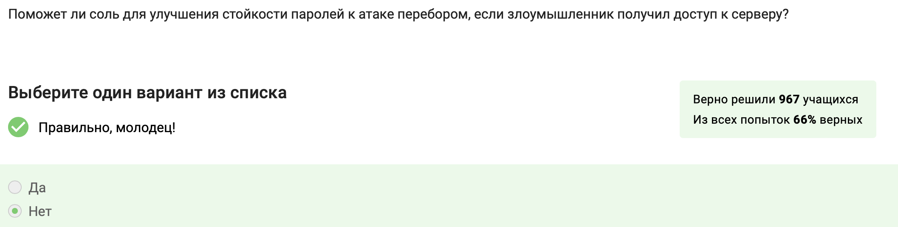{width=80%}

№9) Есть такой сервис для проверки, утёк ли ваш пароль где-либо: он называется haveibeenpwned.com. Вы можете зайти на этот сайт, забить какой-то свой аккаунт и проверить, засветились ваши данные в базах данных серверов, ключи к которым утекли.

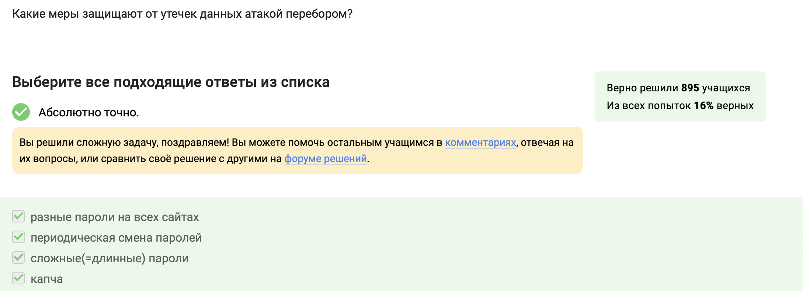{width=80%}

№10) Ссылки на Google и Mail.Ru выглядят легитимными, так как ведут на официальные страницы входа в аккаунты этих сервисов.
Ссылка на Сбербанк содержит подозрительный домен wix.ru, который не является официальным доменом Сбербанка. Это признак фишинговой ссылки.
Ссылка на Яндекс также подозрительна, так как содержит домен ucoz.ru, который не принадлежит Яндексу. Кроме того, оригинальная ссылка на вход в Яндекс не содержит параметра origin.

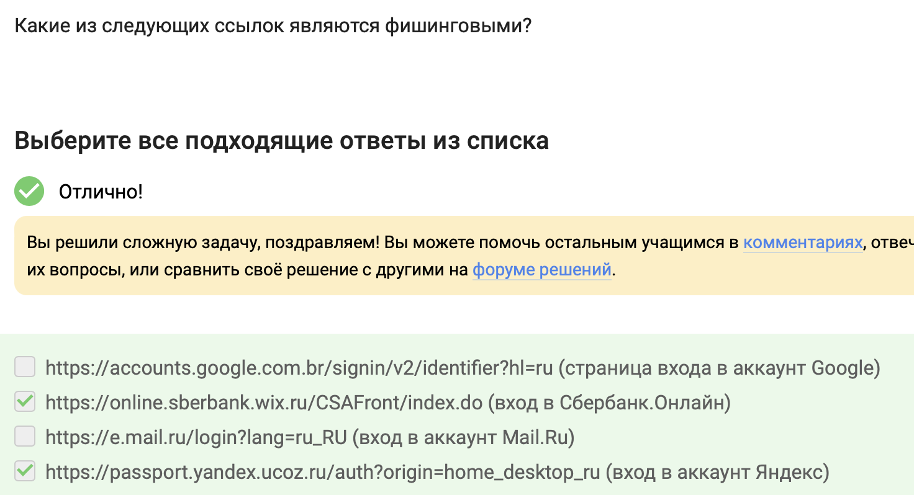{width=80%}

№11) Фишинговый имейл может прийти от знакомого адреса, так как злоумышленники могут подделывать адрес отправителя, чтобы создать ложное впечатление о легитимности сообщения. Это стратегия, используемая в почтовом фишинге, где злоумышленники могут подделать адрес, чтобы он напоминал официальный или адрес знакомого.

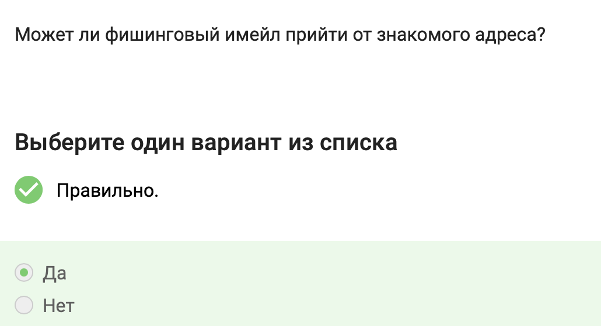{width=80%}

№12) Email спуфинг - это подделка адреса отправителя в электронных письмах с целью обмана получателя. Злоумышленники используют спуфинг для различных вредоносных целей:
- Рассылка спама от имени известных организаций или контактов получателя
- Фишинг - подделка email-адресов сервисов, чтобы убедить жертву перейти на фишинговый ресурс и ввести учетные данные
- Компрометация корпоративной почты (BEC) - преступники притворяются сотрудниками, клиентами, партнерами или подрядчиками организации, чтобы вынудить реальных сотрудников перевести деньги или выдать конфиденциальную информацию
Спуфинг работает путем технического приема выдачи себя за другое лицо, чтобы обмануть сеть или конкретного пользователя и вызвать доверие в надежность источника информации. Например, хакеры могут применить спуфинг IP и DNS-запросов, чтобы переадресовать пользователя на мошеннические сайты.

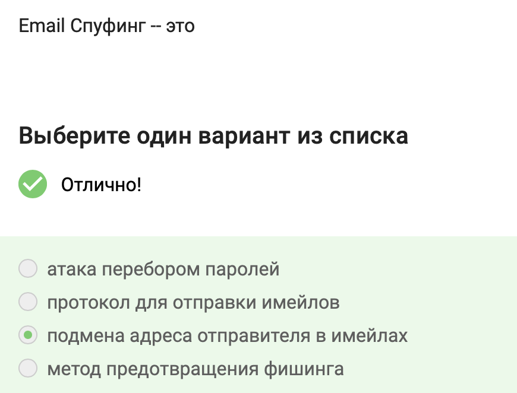{width=80%}

№13) Трояны - это вредоносные программы, которые маскируются под привычное и чаще всего популярное ПО, скрывая своё настоящее назначение. Пользователи сами по незнанию или невнимательности запускают зловредный код на устройстве.
Работает исключительно под OC Windows.

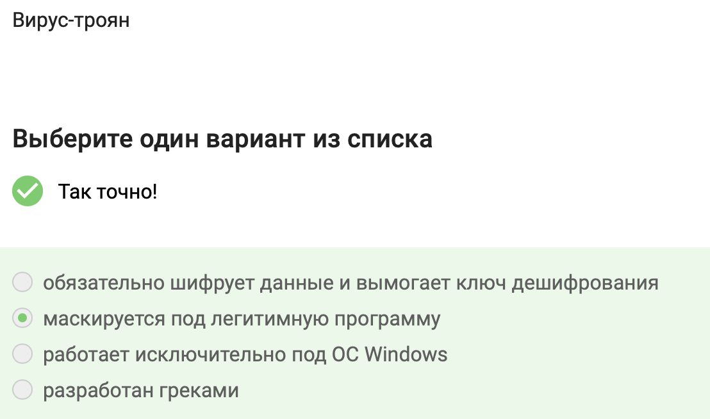{width=80%}

№14) Сквозное шифрование в протоколах Signal реализовано в двух больших шагах: это те же самые шаги, которые мы с вами уже встречали в протоколе TLS, когда говорили о безопасной коммуникации с веб-сервером. Вначале мы генерируем общий ключ, для этого опять же рассмотрим 2 людей, 2 смартфона - Алиса и Боб. Алиса хочет отправить какое-то сообщение Бобу. Что делает Боб? Боб публикует на сервере свою открытую информацию, то есть открытый кусочек своего ключа. Если Алиса хочет отправить какое-то сообщение Бобу, она берет этот открытый кусочек ключа от Боба, генерирует общий ключ и с помощью этого общего ключа отправляет сообщение уже зашифрованное под этим общим ключом Бобу.

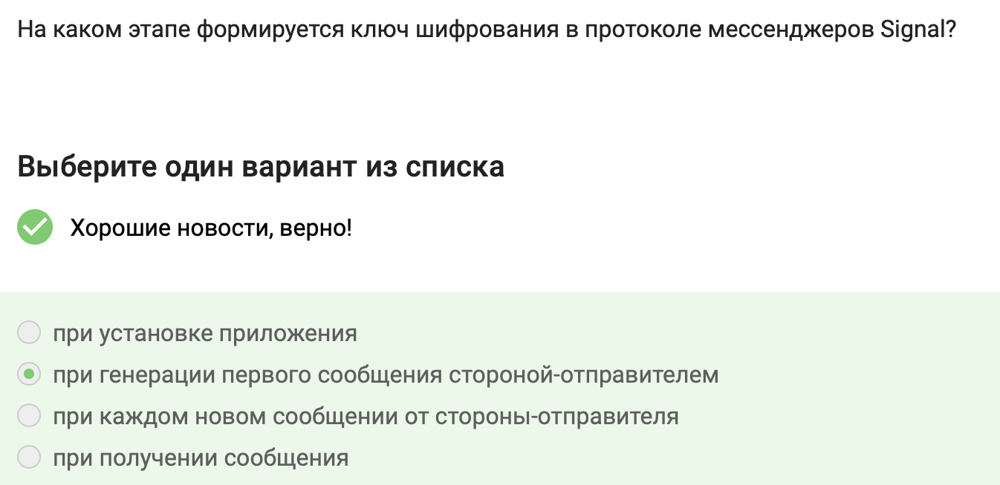{width=80%}

№15) Суть довольно простая: у нас есть два участника - Алиса и Боб, A и B, и сквозное шифрование заключается в том, что сервер, который передает сообщение, который направляет сообщение от Алисы к Бобу или от Бобу к Алисе, знает только то, куда эти сообщения должны быть направлены, но сообщения он передает в зашифрованном виде, то есть он как бы работает маршрутизатором  сообщений, не зная о том, что он передает.

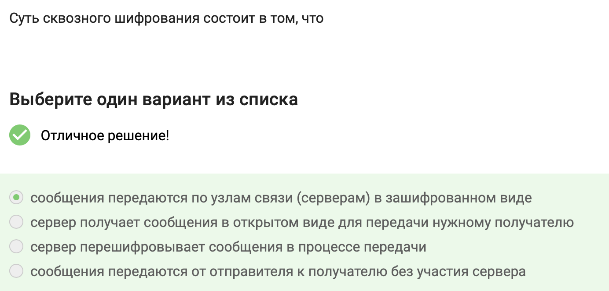{width=80%}
