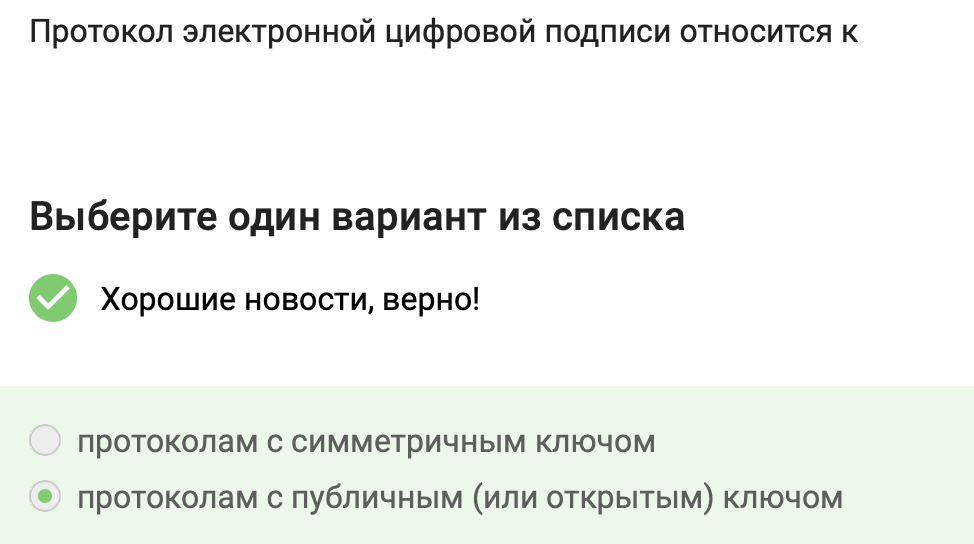
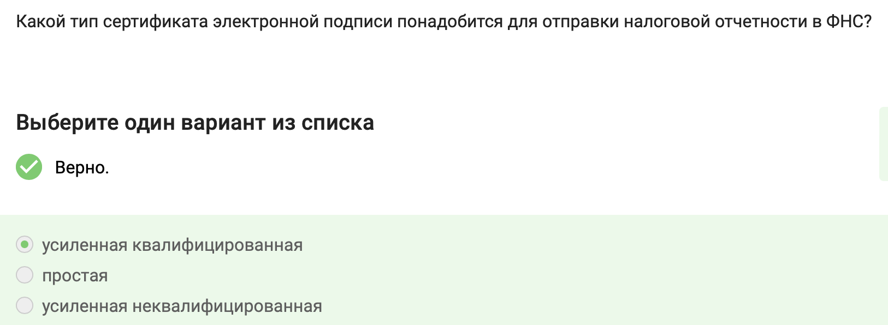

---
## Front matter
title: "Отчет по внешнему курсу"
subtitle: "Тема: Криптография на практике"
author: "Шубнякова Дарья НКАбд-03-22"

## Generic otions
lang: ru-RU
toc-title: "Содержание"

## Bibliography
bibliography: bib/cite.bib
csl: pandoc/csl/gost-r-7-0-5-2008-numeric.csl

## Pdf output format
toc: true # Table of contents
toc-depth: 2
lof: true # List of figures
lot: true # List of tables
fontsize: 12pt
linestretch: 1.5
papersize: a4
documentclass: scrreprt
## I18n polyglossia
polyglossia-lang:
  name: russian
  options:
    - spelling=modern
    - babelshorthands=true
polyglossia-otherlangs:
  name: english
## I18n babel
babel-lang: russian
babel-otherlangs: english
## Fonts
mainfont: PT Serif
romanfont: PT Serif
sansfont: PT Sans
monofont: PT Mono
mainfontoptions: Ligatures=TeX
romanfontoptions: Ligatures=TeX
sansfontoptions: Ligatures=TeX,Scale=MatchLowercase
monofontoptions: Scale=MatchLowercase,Scale=0.9
## Biblatex
biblatex: true
biblio-style: "gost-numeric"
biblatexoptions:
  - parentracker=true
  - backend=biber
  - hyperref=auto
  - language=auto
  - autolang=other*
  - citestyle=gost-numeric
## Pandoc-crossref LaTeX customization
figureTitle: "Рис."
tableTitle: "Таблица"
listingTitle: "Листинг"
lofTitle: "Список иллюстраций"
lotTitle: "Список таблиц"
lolTitle: "Листинги"
## Misc options
indent: true
header-includes:
  - \usepackage{indentfirst}
  - \usepackage{float} # keep figures where there are in the text
  - \floatplacement{figure}{H} # keep figures where there are in the text
---

# Задания

№1) В асимметричных криптографических примитивах одна сторона имеет пару из открытого и секретного ключей, а другая сторона использует открытый ключ для шифрования сообщений, которые могут быть расшифрованы только с помощью соответствующего секретного ключа.
Таким образом, в асимметричных криптосистемах каждый участник имеет свою пару ключей - открытый ключ для шифрования и секретный ключ для расшифрования. Открытый ключ может быть свободно распространен, в то время как секретный ключ держится в тайне.

{width=80%}

№2) Эти свойства характеризуют криптографическую хеш-функцию. Она должна быть эффективной в вычислениях, устойчивой к коллизиям (когда разным входным данным соответствует одинаковый хеш), и выдавать фиксированное число бит на выходе, независимо от объема входных данных.

{width=80%}

№3) AES - это симметричный блочный шифр, который используется для шифрования и расшифровки данных. Он обеспечивает конфиденциальность передаваемой информации. AES работает с фиксированными блоками данных размером 128 бит и использует ключи длиной 128, 192 или 256 бит.
SHA-2 - это семейство криптографических хеш-функций, включающее алгоритмы SHA-224, SHA-256, SHA-384 и SHA-512. Они используются для создания цифровых подписей, проверки целостности данных и аутентификации. SHA-2 гарантирует, что даже незначительное изменение входных данных приведет к совершенно другому хешу (аваланшный эффект). Из хеша невозможно восстановить исходные данные.

{width=80%}

№4) Код аутентификации сообщения (MAC) относится к симметричным примитивам. 
MAC - это криптографический метод с симметричным ключом, который обеспечивает аутентификацию сообщения. В симметричной криптографии один и тот же ключ используется как для шифрования, так и для расшифрования данных, включая аутентификацию.

{width=80%}

№5) Протокол Диффи-Хеллмана позволяет двум сторонам, Алисе и Бобу, создать общий секретный ключ шифрования, используя незащищенный канал связи. Каждая сторона генерирует свой приватный ключ, а затем вычисляет открытый ключ на основе приватного и общих параметров. Обмениваясь открытыми ключами, Алиса и Боб могут независимо вычислить одинаковый секретный ключ, который затем используется для шифрования дальнейшего обмена сообщениями.
Таким образом, протокол Диффи-Хеллмана относится к асимметричным криптографическим примитивам, так как использует пару ключей - открытый и секретный, но в итоге генерирует общий секретный ключ для симметричного шифрования.

{width=80%}

№6) Электронная цифровая подпись использует асимметричные криптосистемы, где для создания и проверки подписи используются пары ключей - открытый и закрытый. Отправитель использует свой закрытый ключ для создания подписи, которая затем может быть проверена с помощью соответствующего открытого ключа, обеспечивая аутентификацию и целостность сообщения.

{width=80%}

№7) Алгоритм верификации электронной цифровой подписи требует на вход подпись, открытый ключ, сообщение.
Для проверки электронной цифровой подписи используется открытый ключ, который позволяет проверить подлинность подписи, а также само сообщение, к которому применялась подпись.

{width=80%}

№8) Электронная цифровая подпись не обеспечивает конфиденциальность.
Электронная цифровая подпись предназначена для обеспечения аутентификации источника данных, целостности сообщения, и неотказ от авторства, но не предназначена для обеспечения конфиденциальности данных.

{width=80%}

№9) Для отправки налоговой отчетности в ФНС потребуется усиленная квалифицированная электронная подпись.
Усиленная квалифицированная электронная подпись обладает высоким уровнем доверия и подтверждает личность подписанта, что является необходимым требованием для отправки налоговой отчетности в ФНС.

{width=80%}

№10) Вы можете получить квалифицированный сертификат ключа проверки электронной подписи в удостоверяющем (сертификационном) центре. Удостоверяющие центры специализируются на выдаче и обслуживании сертификатов электронной подписи, включая квалифицированные сертификаты, которые требуются для различных целей, включая отправку налоговой отчетности в ФНС.

{width=80%}

№11) Платежные системы - это совокупность правил, процедур и технической инфраструктуры, обеспечивающих проведение финансовых операций без использования наличных денег, с помощью банковских карт и электронных платежей. Они выступают посредником между плательщиком и получателем денег.
POS-терминал является частью платежной инфраструктуры, как и банкомат. BitCoin - это криптовалюта, которая может быть использована для безналичных переводов денег или их аналогов. Она не является традиционной платежной системой, как Mastercard или МИР, но может быть использована для электронных платежей. SecurePay - это платежный сервис, предоставляемый различными компаниями, такими как SecurePay в Австралии и SecurePay в США. SecurePay предлагает онлайн платежные шлюзы для обработки платежей, включая возможность принимать платежи онлайн, подробные отчеты, подписки и биллинг, а также интеграцию с различными платежными методами, такими как Apple Pay.

{width=80%}

№12) Многофакторная аутентификация предполагает использование нескольких различных факторов для подтверждения личности пользователя, обычно это что-то, что пользователь знает (пароль), что-то, что у него есть (код в sms сообщении), и что-то, что он является (отпечаток пальца).

{width=80%}

№13) Многофакторная аутентификация предполагает использование нескольких различных факторов для подтверждения личности пользователя, обычно это что-то, что пользователь знает (пароль), что-то, что у него есть (код в sms сообщении), и что-то, что он является (отпечаток пальца).
При онлайн платежах покупатель проходит многофакторную аутентификацию перед банком, который выпустил его карту (банк-эмитент). Это необходимо для подтверждения личности покупателя и предотвращения мошенничества.
Однофакторная аутентификация при помощи PIN-кода карты используется при оплате в физических терминалах, а не при онлайн платежах. Банк-эквайер, предоставляющий торговцу возможность принимать платежи, не требует многофакторной аутентификации от покупателя.

{width=80%}

№14) Свойство криптографической хэш-функции, которое используется в доказательстве работы, это сложность нахождения прообраза.
Доказательство работы (Proof of Work) в криптографии используется для подтверждения выполнения определенной работы, например, для создания нового блока в блокчейне. Сложность нахождения прообраза означает, что для данного хеша сложно найти исходные данные, которые привели к этому хешу. Это свойство хеш-функций обеспечивает безопасность и надежность доказательства работы

{width=80%}

№15)
- Постоянство (immutability) - записи в блокчейне невозможно изменить или удалить задним числом. Каждый новый блок надежно связан с предыдущими, образуя неразрывную цепочку.
- Консенсус (consensus) - это процесс, в ходе которого участники сети достигают согласия о текущем состоянии данных в блокчейне. Благодаря этому алгоритмы консенсуса устанавливают надежность и доверие к сети.
- Открытость (openness) - большинство блокчейнов являются открытыми распределенными реестрами, где любой может присоединиться в качестве узла и участвовать в процессе консенсуса.
- Живучесть (liveness) - блокчейн продолжает работать и обрабатывать транзакции даже если часть узлов выйдет из строя. Он устойчив к сбоям и атакам.

{width=80%}

№16) Участники блокчейна хранят секретные ключи для цифровой подписи.
В блокчейне каждый пользователь имеет пару ключей - секретный ключ, который используется для подписи транзакций, и открытый ключ, который служит основанием для определения биткоин-адреса. Секретный ключ хранится в кошельке пользователя и используется для создания цифровой подписи, подтверждающей, что транзакция исходит от владельца ключа.

{width=80%}
